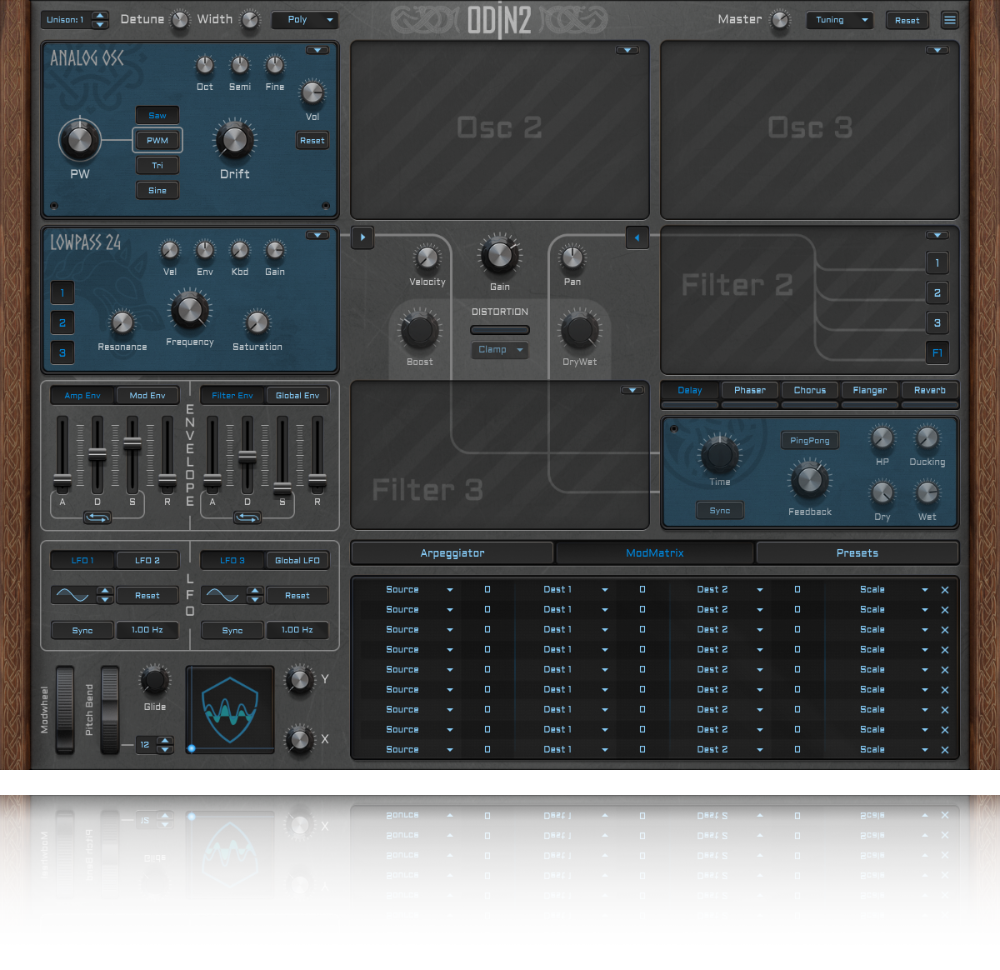

# Odin 2 Synthesizer

This is the home of Odin 2 freeware VST and AU synthesizer plugin.



# Build Instructions
## All Platforms
[Download JUCE](https://juce.com/get-juce/download). The project is currently build against JUCE 6.0.1, using newer versions might need some adjustments. Legacy versions can be found [here](https://github.com/juce-framework/JUCE/releases). Open the file `odin2/Odin.jucer` with the `Projucer` application from the JUCE main directory. Now generate the build files by pressing `Ctrl + P` inside the `Projucer`. You can close `Projucer` now.

## Windows (Visual Studio 2019)

Open the VS2019 solution `odin2/Builds/VisualStudio2019/Odin2.sln` with `VisualStudio2019` and compile the project.

## MacOS X (XCode)

Open the XCode project `odin2/Builds/MacOSX/Odin2.xcodeproj` and compile it.

## Linux (Makefile)

Open a terminal and navigate to `odin2/Builds/LinuxMakefile`. Now compile the project with `make`. You will most likely hit some errors because header files are not found. You need to find out which packages the header belongs to and install the required packages. For Ubuntu 18.04, the required packages can be installed with
```
sudo apt install libx11-dev libwebkit2gtk-4.0-dev mesa-common-dev libasound2-dev libcurl4-gnutls-dev libcurl4-gnutls-dev
```

## Compiling as VST2 Plugin
VST2 is no longer licensed by Steinberg. You will need to find the `VST2 SDK` on the internet yourself. Once you have it, open `Odin.jucer` with the `Projucer` again. Navigate to `File -> Global Paths...` and under `VST (Legacy) SDK` insert the path to the `VST2_SDK` folder. Close the window and hit the gear-icon on the top left of the `Projucer` interface. Under `Plugin Formats` enable `VST (Legacy)`. Press `Ctrl + S` and build the project again as described above.

**IMPORTANT**: Steinbergs licencing prohibits you from distributing any VST2 plugins, unless you've been a registered developer with them since 2018.

## Compiling as LV2 Plugin (Linux)
For LV2 you'll need a custom set of JUCE modules from the [LV2 Porting Project](https://github.com/lv2-porting-project/). Clone the JUCE fork and check out the `lv2` branch, e.g.:
```
git clone -b lv2 https://github.com/lv2-porting-project/JUCE/ ~/JUCELV2
```
Now make your **regular** `Projucer` look for the modules in this repo:
```
/path/to/juce/Projucer --set-global-search-path linux defaultJuceModulePath ~/JUCELV2/modules
```
Resave the project
```
/path/to/jucer/Projucer --resave odin2/Odin2.jucer
```
Add these lines to `odin2/JuceLibraryCode/AppConfig.h` and make sure they are contained within the user code section:
```
// [BEGIN_USER_CODE_SECTION]

  #define JucePlugin_Build_LV2 1
  #define JucePlugin_LV2URI "https://www.thewavewarden.com/odin2"
  #define JucePlugin_MaxNumInputChannels 2
  #define JucePlugin_MaxNumOutputChannels 2

// [END_USER_CODE_SECTION]
```
The last step is to append a line to the generated Makefile with this command:
```
echo -e "include ../../LV2.mak" >> odin2/Builds/LinuxMakefile/Makefile
```
Now you can build the project again with `make` as before. Note: Every time you export the project from the `Projucer`, you'll have to append the line to the Makefile again.
